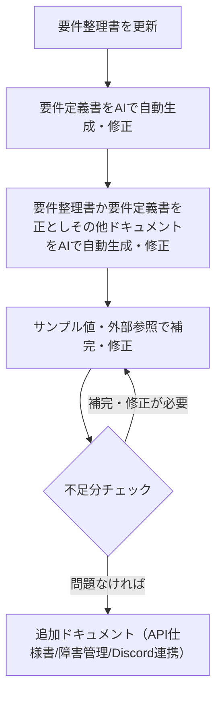
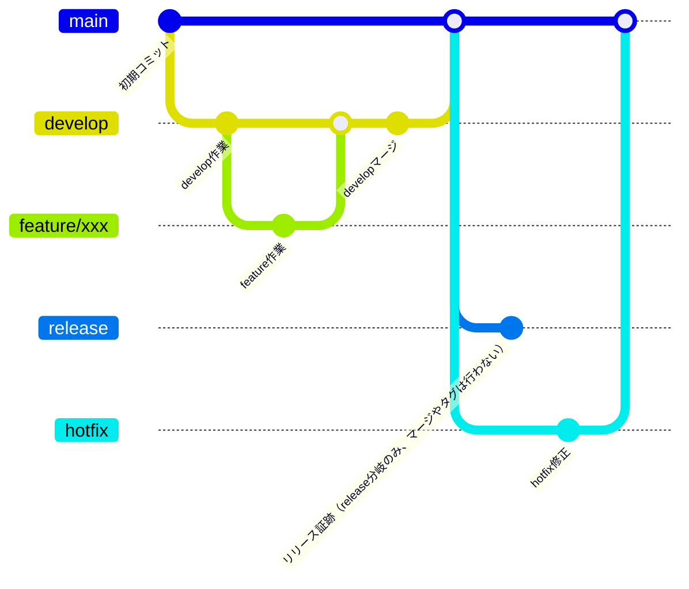

# 本リポジトリについて

このリポジトリは「ris-」プレフィックスが付く全リポジトリの中心的な管理リポジトリです。

- ris-系リポジトリのREADMEやディレクトリ構成、PRテンプレートのたたき台、ビルド用シェルスクリプト（sh）なども本リポジトリで一元管理しています。
- 新規開発・運用・コントリビュートの際は、まず本リポジトリのREADME・構成・テンプレート類やドキュメントを参照してください。
- ris-系の他リポジトリも本リポジトリの方針・構成に準拠しています。

## 目次

- [クイックスタート](#クイックスタート)
- [プロジェクト概要](#プロジェクト概要)
- [ディレクトリ・ファイル構成](#ディレクトリファイル構成)
- [ドキュメント一覧](#ドキュメント一覧)
- [開発環境セットアップ](#開発環境セットアップ)
  - [必要な環境・ツール](#必要な環境ツール)
  - [必要なソフトウェアのインストール](#必要なソフトウェアのインストール)
  - [VS Code拡張機能（推奨）](#vs-code拡張機能推奨)
  - [開発環境](#開発環境)
  - [プッシュ](#プッシュ)
  - [ブランチ運用フロー](#ブランチ運用フロー)
  - [コミットメッセージ](#コミットメッセージ)
  - [PRテンプレート](#prテンプレート)
  - [PR事前作業](#pr事前作業)
  - [実行](#実行)
  - [デストロイ](#デストロイ)
- [コマンド一覧](#コマンド一覧)
- [注意事項](#注意事項)
- [CI/CD（GitHub Actions）](#cicdgithub-actions)
  - [CI（継続的インテグレーション）](#ci継続的インテグレーション)
  - [CD（継続的デリバリー）](#cd継続的デリバリー)
- [GitHub運用方針](#github運用方針)
  - [管理者バイパスについて](#管理者バイパスについて)
  - [必須ステータスチェックを行わない理由](#必須ステータスチェックを行わない理由)
- [FAQ（よくある質問）](#faqよくある質問)
- [Copilot運用方針・自動生成規約](#copilot運用方針自動生成規約)
- [サポート・問い合わせ](#サポート問い合わせ)

# クイックスタート

このセクションでは、最小限のステップで開発環境をセットアップし、すぐに開発を開始する手順を説明します。

## 前提条件

以下のソフトウェアがインストール済みであることを確認してください：
- Git
- Docker Desktop
- Visual Studio Code
- SSH鍵（GitHub用）

詳細なインストール手順は[必要なソフトウェアのインストール](#必要なソフトウェアのインストール)を参照してください。

## 5分で始める

### 1. リポジトリのクローン

```bash
git clone git@github.com:deidra-JP-windows/ris-infra-core.git
cd ris-infra-core
```

### 2. 開発環境の起動

初回起動時：
```bash
./build_command.sh first-up
```

2回目以降：
```bash
./build_command.sh up
# または既存のコンテナに接続
./build_command.sh exec
```

### 3. Dev Containersで開く

1. VS Codeでコマンドパレット（Ctrl+Shift+P / Cmd+Shift+P）を開く
2. 「Dev Containers: Attach to Running Container」を選択
3. ris-infra-core コンテナを選択

### 4. 開発を開始

```bash
# 作業ブランチを作成
git checkout develop
git checkout -b feature/your-feature-name

# Terraformの確認（例：dev環境）
cd /ris-infra-core/riften_web_infra/terraform/dev
terraform fmt -recursive
terraform validate
```

詳細な開発フロー・ブランチ運用については[プッシュ](#プッシュ)および[ブランチ運用フロー](#ブランチ運用フロー)を参照してください。

# プロジェクト概要
このリポジトリは、ゲームコミュニティ用ウェブサイトのインフラ構築・運用を目的としています。
AWSを中心としたIaC（Infrastructure as Code）による環境管理、関連ドキュメントの一元管理を行います。
運用効率・可読性を重視し、必要以上の工数をかけない方針です。

## ディレクトリ・ファイル構成
- `/documents/systems` : システム全体の設計・運用に関するドキュメント（構成図、要件定義書、仕様書等）
- `/riften_web_infra/terraform/00_modules/` : Terraformモジュール群
- `/riften_web_infra/terraform/{ENV}/` : 環境別（dev, stg, prod）のTerraform構成
- `/riften_web_infra/tools/` : 開発Tipsや補助ツール、検証用コード
- `/build_command.sh` : 開発環境コンテナ操作用スクリプト
- `/Dockerfile` : 開発環境用Dockerイメージ定義
- `documents/knowhow/` : 開発や運用に関するノウハウ・手順書・設定例などのドキュメントを格納

## ドキュメント一覧
要件整理書をたたき台として、他ドキュメントをAI（GitHub Copilot）で生成・更新しています。


- `（サンプル）アーキテクチャ図.drawio` : システム全体の構成・AWSリソース・外部連携のアーキテクチャ図のサンプル
  - ネットワーク構成図で最低限の確認観点は充足しているため、サンプルだけ残して更新しない方針
- `ER図.md` : サービスのエンティティ・リレーション図（Mermaid記法）
- `アクセスコントロール図.md` : RBAC・API経由のアクセス制御図
- `シーケンス図_メンテナンスページ.md` : CloudFrontメンテナンスページ切り替えのシーケンス図
- `シーケンス図_内部向けWEBサイトとスマホアプリのトークン認証.md` : 内部向けWEB/アプリの認証・データ連携シーケンス図
- `データフロー図.md` : Web/アプリ/バックエンド/S3間のデータフロー図
- `ネットワーク構成図.md` : AWSクラウド・クライアント間のネットワーク構成図
- `ワークフロー図.md` : 外部・内部ユーザの利用フロー全体図
- `要件整理書_RIシステム.md` : サービス全体の要件整理（起点となるドキュメント）
- `要件定義書_RIシステム.md` : 業務・機能・非機能要件の詳細定義
- `調達仕様書_RIシステム.md` : 調達・契約関連仕様（参考ひな形）
- `Discord連携設計書.md` : Discord APIとの外部連携設計・運用方針（障害通知・運用アラート等の連携仕様）
- `障害管理設計書.md` : システム障害・エラーの管理・通知・記録に関する設計・運用方針
- `API仕様書.md` : RIシステムのAPI仕様を記載するためのテンプレート

## 開発環境セットアップ
### 必要な環境・ツール
- OS: Windows 11 以上（Mac/Linuxも可）
- 必須: `wsl`, `git`, `docker`, `openssh`（鍵作成）
- 推奨: VS Code（拡張機能「Dev Containers」）

### 必要なソフトウェアのインストール
※ ダウンロード済みの場合は飛ばしてください。

#### Visual Studio Codeのインストール
1. [Visual Studio Code公式サイト](https://code.visualstudio.com/download)にアクセス
2. インストーラーをダウンロードし、指示に従って進める
   - インストールオプションは以下を推奨：
     - 「デスクトップ上にアイコンを作成する」にチェック
     - 「PATH に追加する」にチェック
     - 「エクスプローラーのファイル コンテキスト メニューに "Code で開く" アクションを追加する」にチェック
3. インストール後の確認：
   - PowerShellを開いて以下のコマンドを実行
   ```bash
   code --version
   ```
   - バージョン情報が表示されれば成功

#### Docker Desktopのインストール
1. [Docker Desktop公式サイト](https://docs.docker.com/desktop/setup/install/windows-install/)にアクセス
2. インストーラーをダウンロードし、指示に従って進める
3. インストール後の確認：
   - PowerShellを開いて以下のコマンドを実行
   ```bash
   docker --version
   ```
   - バージョン情報が表示されれば成功

#### Gitのインストール
1. [Git公式サイト](https://git-scm.com/downloads)にアクセス
2. インストーラーをダウンロードし、指示に従って進める
3. インストール後の確認：
   - PowerShellを開いて以下のコマンドを実行
   ```bash
   git --version
   ```
   - バージョン情報が表示されれば成功

#### SSHキーの設定
##### PowerShellまたはコマンドプロンプトを開き、ユーザーディレクトリ直下に移動
```sh
例
cd /
cd C:\Users\Admin
```

##### ED25519形式でパスワードありのSSH鍵を作成
```sh
ssh-keygen -t ed25519
```
※ コマンド実行時に「Enter passphrase (empty for no passphrase):」と表示されたら、任意のパスワードを入力してください。
※ 作成後ユーザ直下に .ssh フォルダがない場合、手動で作成しコマンド実行により作成されたファイルを移動させてください。
※ 

##### 公開鍵の内容を手動でコピー
Visual Studio Code（VSCode）等で `%USERPROFILE%\.ssh\id_ed25519.pub` を開き、内容をすべてコピーします。

##### GitHubにログインし、SSH鍵を登録
   - GitHubの右上アイコン → [Settings] → [SSH and GPG keys] → [New SSH key]
   - Titleに任意の名前、Keyに先ほどコピーした公開鍵を貼り付けて [Add SSH key] をクリック

##### .ssh/configファイルを作成・編集し、以下を記載
※ 拡張子は不要です。Visual Studio Code（VSCode）で開くと画像にあるボタンから作成できます。
※ 
※ 
```config
Host github.com
	IdentityFile ~/.ssh/id_ed25519
	User git
```

##### 接続確認
```sh
ssh -T git@github.com
```
"Hi ユーザー名! You've successfully authenticated..." と表示されれば成功です。

#### セットアップ手順
##### リポジトリのクローン
任意の場所に作業用のフォルダを作り、そのフォルダをVSCodeで開きます。
左上のTerminal → New Terminalからターミナルを開き、このリポジトリをローカル環境にクローンします。  

```bash
git clone git@github.com:deidra-JP-windows/ris-bot-discord.git
cd ris-bot-discord
```

##### 実行環境の初期セットアップ
初回のセットアップ時は、以下のコマンドを実行します：

```bash
./build_command.sh first-up
```

このコマンドは以下の処理を実行します：
- Dockerイメージのビルド
- コンテナの作成と起動
- SSH鍵の設定
- リポジトリのクローン（コンテナ内）

##### 通常の起動方法
2回目以降の起動時は、以下のいずれかのコマンドを使用します：

```bash
# コンテナを新規作成して起動する場合
./build_command.sh up

# 既存のコンテナに接続する場合
./build_command.sh exec
```

##### コンテナの停止と削除
```bash
# コンテナを停止する
./build_command.sh stop

# コンテナを停止して削除する
./build_command.sh down
```

##### 環境の再構築
Dockerfileに変更があった場合や環境を完全に作り直したい場合は、以下のコマンドを実行します：

```bash
./build_command.sh rebuild
```

## コマンド一覧

| コマンド | 説明 |
|----------|------|
| `first-up` | 初回セットアップ用。イメージのビルド、コンテナの作成・起動、SSH設定を行います |
| `up` | 新規コンテナを作成して起動します |
| `exec` | 既存のコンテナに接続します（停止中の場合は再起動します） |
| `stop` | コンテナを停止します |
| `down` | コンテナを停止して削除します |
| `rebuild` | 環境を完全に再構築します |

## 注意事項

- SSHの設定ファイルは `C:/Users/<ユーザー名>/.ssh` から自動的にマウントされます
- コンテナ内では `/ris-bot-discord` ディレクトリにリポジトリがクローンされます
- 環境変数 `MSYS_NO_PATHCONV=1` はWindowsでのパス変換問題を回避するために使用されています


### VS Code拡張機能（推奨）
- Draw.io Integration : VS Code上でDraw.io編集
- Markdown Preview Mermaid Support : Mermaid記法プレビュー

### 外部の拡張機能
効率的な開発を行う為、個人開発の拡張機能で以下の2つを採用しています。
- Draw.io Integration
  - VS Code で Draw.io を操作することが可能
- Markdown Preview Mermaid Support
  - マーメイド記法で書かれたコードをプレビューすることが可能

### 開発環境
以下のコマンドを`Git Bash`環境で実行してください。
コンテナ起動後、リポジトリを `Dev Containers` で開いてください。
```
# 初回起動時
bash build_command.sh first-up
```
```
# 起動時
bash build_command.sh up
```
```
# 接続時
bash build_command.sh exec
# 上記のコマンド、または Remote Explorer → Dev Containers からコンテナを選択し、Attach in New Window からコンテナを起動・接続してください。
```
```
# コンテナ停止時
bash build_command.sh stop
```
```
# イメージ更新時
bash build_command.sh rebuild
```
```
# コンテナ削除
bash build_command.sh down
```

### プッシュ
github に差分をプッシュする際には git-flow を簡略化し運用してください。Github Actions などの実装を簡略化するためタグは使用しません。
- git-flow
  - https://www.atlassian.com/git/tutorials/comparing-workflows/gitflow-workflow

| ブランチ名      | 用途・説明                                      | 直接プッシュ禁止 | マージ先          | ブランチ作成元     |
|:---------------|:-----------------------------------------------|:----------------|:-------------------|:-------------------|
| main           | stg・prod 環境へリリースするブランチ               | ○               | -                 | -            |
| release        | 本番リリース後証跡｜切り戻し用ブランチ              | ○               | -                 | main          |
| hotfix         | main へ修正を入れる際に使用（リリース後のバグ修正等）| ×               | main              | main               |
| develop        | dev 環境へリリースするブランチ                     | ○               | main              | -  |
| feature/*      | 作業ブランチ（ローカル・dev 環境での動作確認も実施） | ×               | develop           | develop            |


### ブランチ運用フロー
Mermaid 記法のため必要に応じて VS Code に拡張機能をインストールしてください。
例：Markdown Preview Mermaid


#### GitHub Actions連携ポイント
- `feature/*` → `develop` へのPR作成・更新時：CI（Secret Scan）が自動実行され、機密情報混入をチェック
- `develop` → `main` へのマージ時：CD（Terraform Apply）が自動実行され、本番環境へ反映
  - それ以外のブランチ操作では自動実行されません

##### GitHub Actionsで使用するリポジトリシークレットの追加方法と方針

GitHub Actionsで利用するシークレット（リポジトリシークレット）は、APIトークンや認証情報などのセキュアなデータのみを登録してください。

## 追加方法
1. GitHubのリポジトリページを開く
2. [Settings] → [Secrets and variables] → [Actions] を選択
3. [New repository secret] をクリック
4. Name（シークレット名）とValue（値）を入力し、[Add secret] で登録
  - 例: `AWS_ACCESS_KEY_ID`, `AWS_SECRET_ACCESS_KEY`, `DISCORD_WEBHOOK_URL` など

## 登録方針
- シークレットには**トークンやパスワード等の機密情報のみ**を登録し、設定値や公開可能な情報は登録しないでください。
- シークレット値は**管理者・運用担当者のみが登録・変更**できるようにしてください。
- シークレット名は用途が分かるように命名し、不要になったものは速やかに削除してください。
- シークレット値は**絶対にコードやログに出力しない**ように注意してください。

> **参考:** シークレットはGitHub Actionsのワークフロー内で `${{ secrets.シークレット名 }}` で参照できます。

### コミットメッセージ
関数単位や同じ修正内容のまとまり単位でコミットしてください。
フォーマットに細かい指定はないですが、作業内容の概要だけ記載をお願いします。
例：[構成変更]_README修正


### PRテンプレート
本リポジトリのPRテンプレート（.github/PULL_REQUEST_TEMPLATE.md）は ris-infra-core リポジトリで管理されている共通テンプレートをベースにしています。
PR作成時は ris-infra-core のテンプレートや運用ルールも参考に、必要事項を記載してください。

#### 注意事項
- PRのタイトル・説明は分かりやすく記載してください。
- レビュワーが確認しやすいよう、必要に応じてスクリーンショットや補足説明を追加してください。
- テンプレートは`.github/PULL_REQUEST_TEMPLATE.md`で管理しています。必要に応じて編集・拡張してください。

### PR事前作業
ソースを更新する際にはフォーマッタとバリデートのコマンドを実行・修正したのちPRを作成してください。
- フォーマッタ
```
cd /front-web-site-for-riften-terraform/riften_web_server/terraform/${ENV}
terraform fmt -recursive
```
- バリデータ
```
cd /front-web-site-for-riften-terraform/riften_web_server/terraform/${ENV}
terraform validate
```

### 実行
デプロイする各環境に対して実行してください。
```
cd /front-web-site-for-riften-terraform/riften_web_server/terraform/{ENV}
terraform init -var-file=terraform.tfvars
terraform plan -var-file=terraform.tfvars
terraform deploy -var-file=terraform.tfvars
```

### デストロイ
デストロイする各環境に対して実行してください。
```
cd /front-web-site-for-riften-terraform/riften_web_server/terraform/{ENV}
terraform destroy -var-file=terraform.tfvarss
```

## CI/CD（GitHub Actions）

### CI（継続的インテグレーション）
- **Secret Scan（.github/workflows/secret_scan.yml）**
  - developブランチへのPull Request作成・更新時に、Terraformディレクトリ配下のAWSアクセスキーID（`AKIA[0-9A-Z]{16}`形式）を正規表現でスキャンします。
  - 検出された場合はCIを失敗させ、コード内へのシークレット情報の混入を防止します。

### CD（継続的デリバリー）
- **Terraform Apply（.github/workflows/terraform_apply.yml）**
  - mainブランチの`riften_web_infra/terraform/prod`配下に変更があった場合のみ、GitHub Actions上でTerraformのinit/plan/applyを自動実行します。
  - AWS認証情報はGitHub Secretsから取得し、CI環境で安全にapplyします。
  - 本番環境への自動反映を担うワークフローです。
  - applyはmainブランチへのpush時のみ自動実行され、PR作成時には実行されません。

#### 補足
GitHub Actionsは、CI（コード品質・セキュリティチェック）とCD（本番反映）を分離して運用しています。Terraformのapplyは本番環境のみ自動化し、PR作成時は手動検証を推奨しています。

## GitHub運用方針
- **Collaborators and teams** で許可したユーザーのみWrite権限を付与し、不要なユーザーのpush権限を制限します。
  - 以下の状態になります。
    - 管理者のみが直接pushできる
    - 外部からの変更は全てPull Request経由となる
    - Pull Requestのマージ権限も管理者のみが持つ
- **rulesetの導入**により、以下のブランチ保護・セキュリティ強化を実施します。
  - mainブランチへの直接push禁止（必ずPull Request経由）
  - Pull Request必須・レビュー必須（例: 1名以上の承認）
    - コードオーナーによるレビューのみ
  - force push禁止
  - 必須ステータスチェック（CI等の成功を必須化）
    - 必要に応じて追加
    - Terraform コマンドは基本手打ちで実行する想定（Github Actions の実行に料金が発生する、PR作成前に確認してほしい等）
  - シークレットスキャン（漏洩防止）
    - CI により実装

### 管理者バイパスについて
本リポジトリでは、GitHubのRuleset（ブランチ保護ルール）において「Repository admin（管理者）」にバイパス権限を付与しています。これにより、管理者は保護ルール（レビュー必須・CI必須等）を無視してマージ等の操作が可能です。運用上、緊急時や例外対応が必要な場合にのみ利用してください。

### 必須ステータスチェックを行わない理由
- 本番環境（mainブランチ）へのマージは必ずPull Request経由で行い、直接pushや強制マージは原則禁止としています。
- Secret Scan等のシークレットチェックは、必要な文字列（例：AWSリソース名や一部の設定値）も誤検知する可能性があるため、必須ステータスチェックには設定していません。CIで警告が出た場合は内容を確認し、問題なければマージする運用としています。

これらの運用により、セキュリティと開発効率のバランスを保っています。

## FAQ（よくある質問）
Q. Windows以外でも開発できますか？
A. 開発環境コンテナ操作用スクリプトが Windows 用のパス指定になっている為、 Mac/Linux 環境は未対応です。

Q. Dev Containersが起動しない場合は？
A. Docker Desktopの再起動やVS Codeの再起動をお試しください。

Q. SSH鍵の作成方法は？
A. `ssh-keygen -t ed25519` で作成できます。

Q. Terraformのバージョンは？
A. 各環境の`provider.tf`を参照してください。

Q. コマンドが失敗する場合は？
A. コンテナの状態（起動/停止）を確認し、必要に応じて`build_command.sh`を実行してください。


## Copilot運用方針・自動生成規約

AI（GitHub Copilot）によるドキュメント・コード自動生成・修正の基準は `.github/copilot-instrucions.md` にまとめています。
本リポジトリの品質・運用効率向上のため、以下の規約を必ず遵守してください。

| 項目         | 内容・要約                                                                                           | 関連性・補足                                                                                   |
|--------------|------------------------------------------------------------------------------------------------------|-----------------------------------------------------------------------------------------------|
| 解説方針     | 必ず日本語で要約・解説。表形式で分かりやすく記載。                                                    | ドキュメント・コードレビュー時の品質担保。                                                     |
| 組織設計     | チームトポロジー（4チーム/3コラボ）・ゼロトラストネットワーク導入。                                    | セキュリティ・運用効率向上。                                                                   |
| プロジェクト構成 | バックエンドは3層アーキテクチャ、フロントはTypeScript SPA。型定義・インターフェイス必須。           | 保守性・拡張性の高い設計。                                                                    |
| コーディング規約 | import/クラス/関数間は2行空ける。グローバル領域はクラス定義とimportのみ。ファイル末尾は改行。         | 可読性・自動整形対応。                                                                        |
| 命名規則     | ディレクトリ：ケバブケース、ファイル：スネークケース、クラス：パスカルケース、関数/変数：スネークケース | 一貫性・自動生成時の混乱防止。                                                                |
| 関数定義     | 関数名直下に引数・リターンのコメント必須。                                                            | レビュー・自動生成時の理解促進。                                                              |

この規約は、AIによる自動生成・修正やチーム開発の品質維持、運用効率化のための基準となります。詳細は `.github/copilot-instrucions.md` を参照してください。

## サポート・問い合わせ
不明点や要望はGitHub Issuesまたは担当者までご連絡ください。
