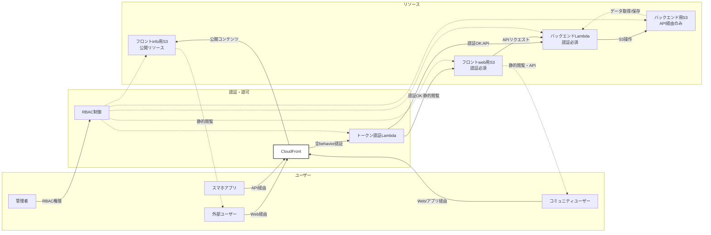

**補足:**  
- 外部ユーザーは公開リソース（S3_Info）のみアクセス可能
- コミュニティユーザーはCloudFront経由で認証後、フロントサイトとAPIにアクセス可能
- スマホアプリはAPI経由で認証後、バックエンドリソースにアクセス
- 管理者はRBAC権限により全リソースに直接アクセス可能
- 全てのアクセスはCloudFront → トークン認証Lambda経由で制御
