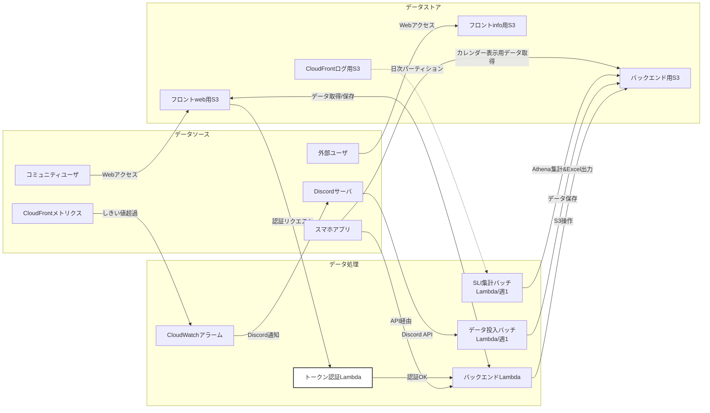

```mermaid
flowchart LR
  subgraph datasource["データソース"]
    User[外部ユーザ]
    Member[コミュニティユーザ]
    App[スマホアプリ]
    Discord[Discordサーバ]
    CF_Metrics[CloudFrontメトリクス]
  end
  
  subgraph processing["データ処理"]
    AuthLambda[トークン認証Lambda]:::edge
    BackendLambda[バックエンドLambda]
    DataBatch[データ投入バッチ<br/>Lambda/週1]
    SLI_Batch[SLI集計バッチ<br/>Lambda/週1]
    CW_Alarm[CloudWatchアラーム]
  end
  classDef edge fill:#fff,stroke:#333,stroke-width:2px;
  
  subgraph datastore["データストア"]
    S3_Info[フロントinfo用S3]
    S3_Front[フロントweb用S3]
    S3_Backend[バックエンド用S3]
    S3_CFLog[CloudFrontログ用S3]
  end
  
  User -- Webアクセス --> S3_Info
  Member -- Webアクセス --> S3_Front
  App -- API経由 --> BackendLambda
  
  S3_Front -- 認証リクエスト --> AuthLambda
  S3_Front <-- データ取得/保存 --> BackendLambda
  
  AuthLambda -- 認証OK --> BackendLambda
  BackendLambda -- S3操作 --> S3_Backend
  
  Discord -- Discord API --> DataBatch
  DataBatch -- データ保存 --> S3_Backend
  
  S3_CFLog -. 日次パーティション .-> SLI_Batch
  SLI_Batch -- Athena集計&Excel出力 --> S3_Backend
  
  CF_Metrics -- しきい値超過 --> CW_Alarm
  CW_Alarm -- Discord通知 --> Discord
  
  App -- カレンダー表示用データ取得 --> S3_Backend
```

**補足:**  
- データソース（ユーザー、外部サービス）→ データ処理（Lambda）→ データストア（S3）の流れで構成
- 認証、API処理、バッチ処理、監視の各データフローを表現
- CloudFrontメトリクスからDiscord通知までのアラートフローも含む
