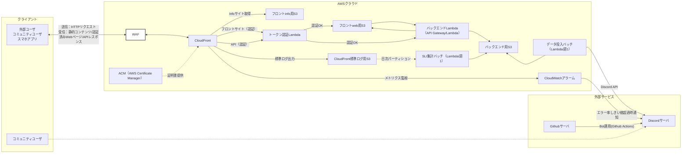

**補足:**  
- クライアント（外部ユーザ/コミュニティユーザ/スマホアプリ）は WAF → CloudFront 経由でHTTPリクエストを送信
- CloudFrontから返される全てのデータ（静的コンテンツ、認証済みWebページ、APIレスポンス）を受信
- バックエンドへの直接アクセスは行わず、全てCloudFront経由で処理
- CloudFrontのメトリクス（エラー率等）をCloudWatchアラームで監視し、しきい値超過時はDiscordに通知
- コミュニティユーザーのみDiscordサーバとの連携あり
