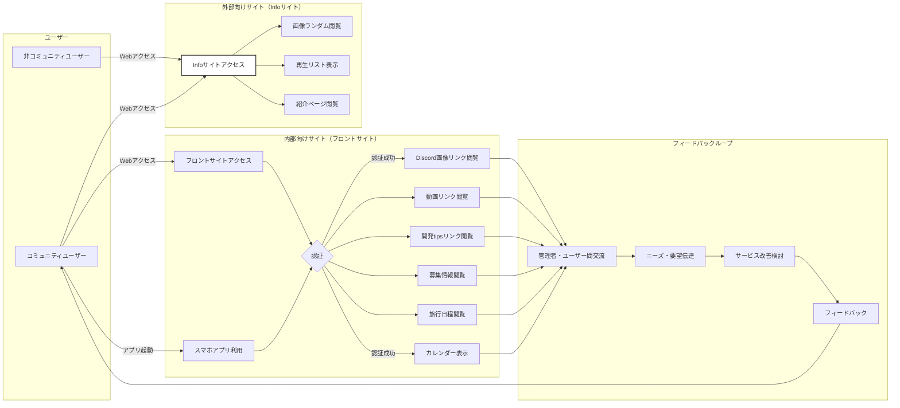

```mermaid
flowchart LR
  subgraph users["ユーザー"]
    NonMember[非コミュニティユーザー]
    Member[コミュニティユーザー]
  end
  
  subgraph infosite["外部向けサイト（Infoサイト）"]
    InfoAccess[Infoサイトアクセス]:::edge
    InfoView1[画像ランダム閲覧]
    InfoView2[再生リスト表示]
    InfoView3[紹介ページ閲覧]
  end
  classDef edge fill:#fff,stroke:#333,stroke-width:2px;
  
  subgraph frontsite["内部向けサイト（フロントサイト）"]
    Auth{認証}
    FrontAccess[フロントサイトアクセス]
    FrontView1[Discord画像リンク閲覧]
    FrontView2[動画リンク閲覧]
    FrontView3[開発tipsリンク閲覧]
    FrontView4[募集情報閲覧]
    FrontView5[旅行日程閲覧]
    AppUse[スマホアプリ利用]
    CalendarView[カレンダー表示]
  end
  
  subgraph feedback["フィードバックループ"]
    Communicate[管理者・ユーザー間交流]
    Feedback[ニーズ・要望伝達]
    Improve[サービス改善検討]
    Response[フィードバック]
  end
  
  NonMember -- Webアクセス --> InfoAccess
  Member -- Webアクセス --> InfoAccess
  Member -- Webアクセス --> FrontAccess
  Member -- アプリ起動 --> AppUse
  
  InfoAccess --> InfoView1
  InfoAccess --> InfoView2
  InfoAccess --> InfoView3
  
  FrontAccess --> Auth
  Auth -- 認証成功 --> FrontView1
  Auth --> FrontView2
  Auth --> FrontView3
  Auth --> FrontView4
  Auth --> FrontView5
  
  AppUse --> Auth
  Auth -- 認証成功 --> CalendarView
  
  FrontView1 --> Communicate
  FrontView2 --> Communicate
  FrontView3 --> Communicate
  FrontView4 --> Communicate
  FrontView5 --> Communicate
  CalendarView --> Communicate
  
  Communicate --> Feedback
  Feedback --> Improve
  Improve --> Response
  Response --> Member
```

**補足:**  
- 非コミュニティユーザーはInfoサイトのみ閲覧可能
- コミュニティユーザーはInfoサイト、フロントサイト、スマホアプリの全てを利用可能
- フロントサイトとスマホアプリは認証が必須
- ユーザーと管理者間のフィードバックループによりサービス改善を継続
