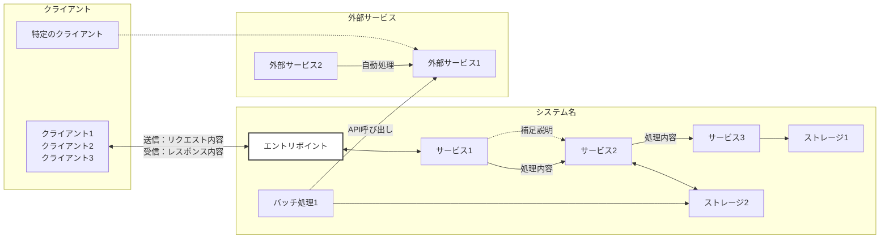
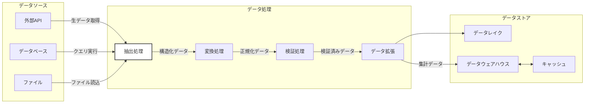
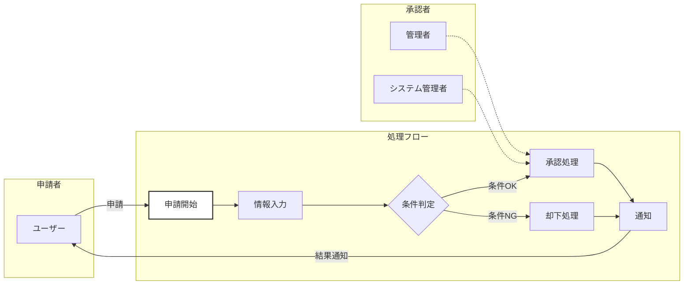
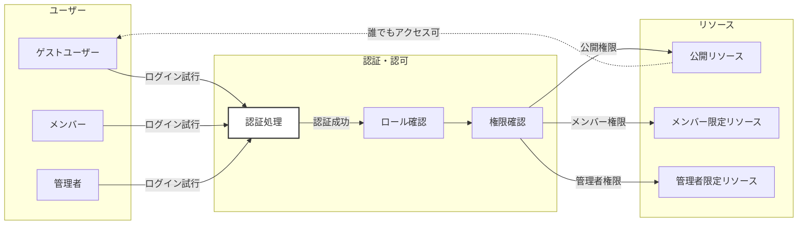

# フロー図テンプレート（指向性のある図）

このテンプレートは、指向性のあるフロー図を作成する際の統一フォーマットです。
左から右へ極力直線で線が伸びるレイアウトを採用し、以下の図に対応しています：

- **ネットワーク構成図**：システム構成とネットワーク接続
- **データフロー図**：データの流れと変換処理
- **ワークフロー図**：業務フローや処理手順
- **アクセスコントロール図**：権限とアクセス制御

## 使用方法
1. 作成したい図の種類に応じたテンプレートを選択
2. このテンプレートをコピーして新しいファイルを作成
3. 各ノード名とラベルを実際の内容に合わせて修正
4. subgraph（グループ）とノードを追加・削除
5. 双方向矢印（<-->）で送受信を1本で表現

## 各図の使い分け

| 図の種類 | 目的 | 主な要素 | 使用例 |
|---------|------|---------|--------|
| ネットワーク構成図 | システム構成・接続関係 | サーバ、クライアント、ネットワーク機器 | AWS構成、インフラ設計 |
| データフロー図 | データの流れ・変換 | データソース、処理、ストレージ | ETL処理、データパイプライン |
| ワークフロー図 | 業務・処理の流れ | タスク、判断、アクター | 業務フロー、承認プロセス |
| アクセスコントロール図 | 権限・アクセス制御 | ユーザー、ロール、リソース | RBAC設計、認可フロー |

## テンプレート1: ネットワーク構成図

## テンプレート2: データフロー図

## テンプレート3: ワークフロー図

## テンプレート4: アクセスコントロール図

## 記法のポイント

| 記法 | 説明 | 使用例 |
|------|------|--------|
| `flowchart LR` | 左から右へのフロー | 必須（全ての図で使用） |
| `subgraph id["表示名"]` | グループ化（日本語は引用符必須） | `subgraph clients["クライアント"]` |
| `Node[表示名]` | ノード定義（矩形） | `WAF[WAF]` |
| `Node{表示名}` | 判定ノード定義（菱形） | `Check{条件判定}` |
| `A --> B` | 単方向矢印 | 一方向の処理フロー、データの流れ |
| `A <--> B` | 双方向矢印 | リクエスト・レスポンス、データの送受信 |
| `A -. 説明 .-> B` | 点線矢印 | 補足的な関連、間接的な影響 |
| `A -- ラベル --> B` | ラベル付き矢印 | 処理内容、データ種別の説明 |
| `:::edge` | スタイルクラス適用 | エントリポイント、重要ノードの強調 |
| ` ` | 改行 | ノード内・ラベル内で改行 |

**注意:** subgraphで日本語や特殊文字（・、など）を使う場合、必ず `subgraph id["表示名"]` の形式で引用符で囲んでください。

## 図の種類別の特徴

### ネットワーク構成図
- クライアント → エントリポイント → サービス → ストレージの順
- 双方向矢印で「送信：」「受信：」を明記
- 外部サービスとの連携は点線で表現

### データフロー図
- データソース → 処理 → データストアの順
- ラベルにデータの種類や形式を記載
- データ変換の各ステップを明確に

### ワークフロー図
- 開始 → 処理 → 判定（菱形ノード）→ 終了の順
- アクターは点線で関連を表現
- 条件分岐は判定ノード{} を使用

### アクセスコントロール図
- ユーザー → 認証・認可 → リソースの順
- 権限レベルごとにリソースを分離
- アクセス可能範囲を点線で補足

## ベストプラクティス

1. **線の数を減らす**
   - 双方向矢印（<-->）で往復を1本で表現
   - 複数の同種ノードを1つに統合可能
   - 共通処理は1つのノードにまとめる

2. **送信・受信やデータ種別を明記**
   - ラベルに「送信：～ 受信：～」形式で記載（ネットワーク構成図）
   - データの種類や形式を記載（データフロー図）
   - 処理内容や条件を記載（ワークフロー図）
   - 権限レベルを記載（アクセスコントロール図）

3. **左から右へのレイアウト**
   - 起点（クライアント、データソース、ユーザー）を最左に配置
   - 処理の流れに沿って左から右へ配置
   - 終点（ストレージ、リソース、完了）を右側に配置

4. **subgraphで構造化**
   - 論理的なグループごとに分離
   - 視覚的な整理と理解促進
   - 責任範囲や境界を明確化

5. **補足は点線で**
   - メインフロー以外は点線（-.->）
   - 本質的な処理フローを際立たせる
   - 間接的な関連や影響を表現

6. **重要ノードを強調**
   - エントリポイントには `:::edge` を適用
   - 複数のスタイルクラスを定義可能
   - 視覚的な優先度を明確化

**補足:**  
- 実際の構成に合わせてノードとフローを追加・削除してください
- プレビューには「Markdown Preview Mermaid Support」などの拡張機能を使用
- 複雑な場合は複数の図に分割することも検討してください
- 各図の種類に応じて適切なテンプレートを選択し、カスタマイズしてください
